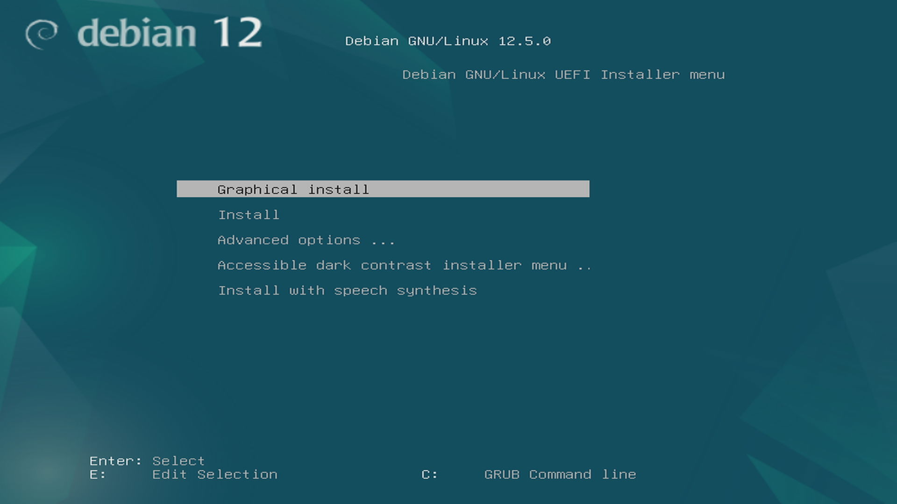
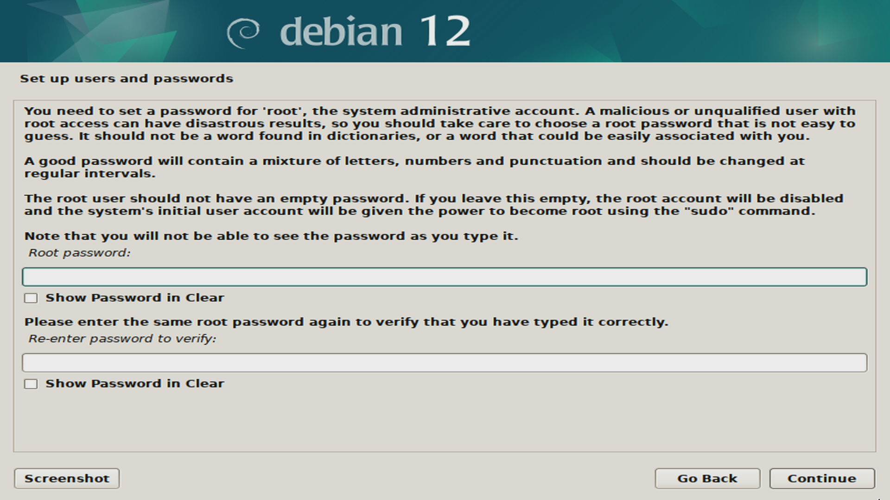
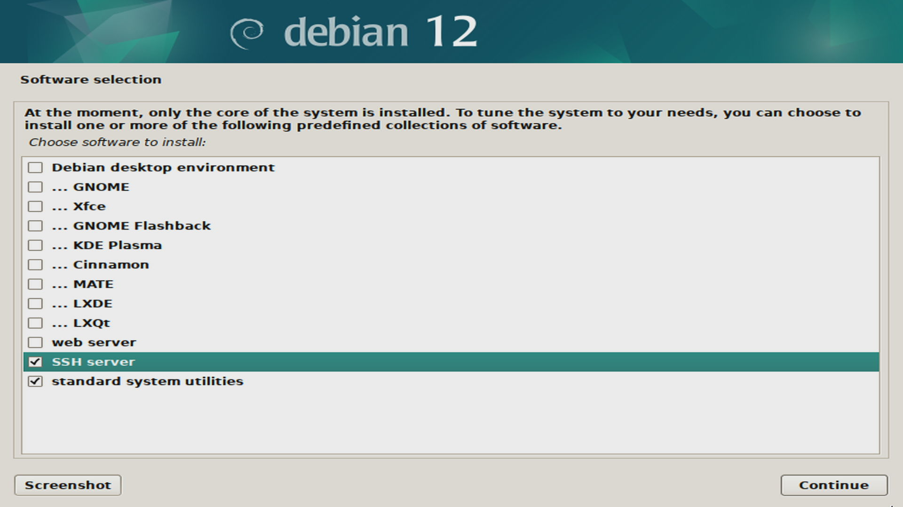
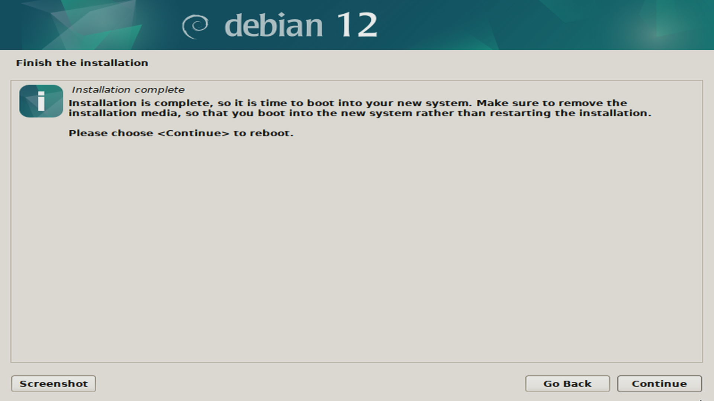

# Creating Debian Nodes

The goal of this guide is to provide step-by-step instructions on how to install [Debian](https://www.debian.org/intro/about), as well as how to prepare the system to be integrated into a Proxmox Cluster.

---

To install Debian first download an **.iso** image from the Debian [download](https://www.debian.org/distrib/netinst) page.
*(Version debian-12.5.0-amd64-netist.iso as of this documentation)*

After downloading the ISO image, a bootable drive must be created. There are many tools available such as [Rufus](https://rufus.ie/en/), [balenaEtcher](https://www.balena.io/etcher), and [Ventoy](https://www.ventoy.net/en/index.html). Once a bootable drive has been created, the installation process can begin.

## Step 1: Select the Graphical Installation Option

1. Turn on the computer after inserting the Debian installation media.
2. On the initial Debian menu, select the `Graphical install` option.
3. This will start the graphical user interface (GUI) based installation process.

## Step 2: Start Basic System Configuration

1. On the next few screens, select the language, location, and keyboard configuration.
2. Depending on the current system, there may be more settings to configure before the next steps can begin. *([Installation Guide](https://www.debian.org/releases/bookworm/installmanual) as of this documentation)*

## Step 3: Set up the Network Connection

1. The installation process will automatically detect physical network interfaces. If there are multiple network interfaces, select the interface to be used as the Primary.
2. If available, ipv4/6 DHCP autoconfiguration will begin. Otherwise manual network setup will need to be completed.

## Step 4: Configure the Root Password and Primary User

1. For the purpose of using Ansible and sudo access on the primary user, do not set the root password. This is specific to preparing the system to integrate properly as a proxmox node.
2. Instead, create a new user account with the desired username and password. This account will have sudo access.

## Step 5: Set the System Timezone

1. On the next screen, select the systems timezone.
2. This will set the time and date for the server. This will be modified later through ansible, but should still be set to complete configuration.

## Step 6: Guided Partitioning of Entire Disk

1. Select the `Guided - use entire disk` option from the list.
2. Choose the drive to be used as the boot drive. It is recommended to have at least two separate drives, one for data, and one for a boot drive.
3. Select the `All files in one partition (recommended for new users)` option. This will create a single partition for all of the files on the server.
4. Finish partitioning and write changes to the specified disk. Confirm the choice and continue the installation.

## Step 7: Package Manager Configuration

1. After the base system installs, select the mirror country and archive mirror for the Debian package manager.
2. If HTTP proxy is required, input value and continue, otherwise skip.
3. Decline participating in the package usage survey and continue.

## Step 8: Default Software Installation Selection

1. Unselect the `Debian desktop environment` and `GNOME` from the software selection. Only the CLI experience is needed for Proxmox.
2. Select `SSH server` from the list to allow Ansible access post installation.
3. Continue and wait for the installation to complete. If prompted, specify whether the system clock is set to UTC and continue.

## Step 9: Finishing Installation of Debian

1. When prompted *Installation complete*, remove the USB drive and select `Continue` to reboot the system and complete the installation process.

The Debian operating system should now be installed and configured on the system. The next step is [Installing Proxmox on top of Debian](proxmox-cluster-setup.md).
